<picture>
  <source media="(prefers-color-scheme: dark)" srcset="assets/header-dark.svg" />
  
</picture>

## Sobre mí

<picture>
  <source media="(prefers-color-scheme: dark)" srcset="assets/about-dark.svg" />
  
</picture>

## Proyectos

<a href="https://github.com/Kevint071/azure-devops-task-editor"><picture><source media="(prefers-color-scheme: dark)" srcset="assets/row-azure-devops-task-editor-dark.svg" /></picture></a><a href="https://github.com/Kevint071/azure-devops-task-editor"><picture><source media="(prefers-color-scheme: dark)" srcset="assets/link-github-dark.svg" /></picture></a><a href="https://azure-devops-task-editor.vercel.app"><picture><source media="(prefers-color-scheme: dark)" srcset="assets/link-web-dark.svg" /></picture></a>
<a href="https://github.com/Kevint071/Finver"><picture><source media="(prefers-color-scheme: dark)" srcset="assets/row-finver-dark.svg" /></picture></a><a href="https://github.com/Kevint071/Finver"><picture><source media="(prefers-color-scheme: dark)" srcset="assets/link-github-dark.svg" /></picture></a><a href="https://finver-web.vercel.app"><picture><source media="(prefers-color-scheme: dark)" srcset="assets/link-web-dark.svg" /></picture></a>
<a href="https://github.com/Kevint071/Taskev"><picture><source media="(prefers-color-scheme: dark)" srcset="assets/row-taskev-dark.svg" /></picture></a><a href="https://github.com/Kevint071/Taskev"><picture><source media="(prefers-color-scheme: dark)" srcset="assets/link-github-dark.svg" /></picture></a><a href="https://taskev.vercel.app"><picture><source media="(prefers-color-scheme: dark)" srcset="assets/link-web-dark.svg" /></picture></a>
<a href="https://github.com/Kevint071/DiezApp"><picture><source media="(prefers-color-scheme: dark)" srcset="assets/row-diezapp-dark.svg" /></picture></a><a href="https://github.com/Kevint071/DiezApp"><picture><source media="(prefers-color-scheme: dark)" srcset="assets/link-github-dark.svg" /></picture></a><a href="https://diezapp-api.vercel.app"><picture><source media="(prefers-color-scheme: dark)" srcset="assets/link-web-dark.svg" /></picture></a>

Arquitectura limpia en [Kelist](https://github.com/Kevint071/Kelist) y [KelistAPI](https://github.com/Kevint071/KelistAPI) (C# / .NET, archivados).

## Stack

<picture>
  <source media="(prefers-color-scheme: dark)" srcset="assets/stack-dark.svg" />
  
</picture>

## Actividad

<picture><source media="(prefers-color-scheme: dark)" srcset="https://github-stats-extended.vercel.app/api?username=Kevint071&show_icons=true&count_private=true&card_width=495&title_color=58a6ff&text_color=e6edf3&icon_color=58a6ff&bg_color=0d1117&hide_border=true" /></picture><picture><source media="(prefers-color-scheme: dark)" srcset="https://github-readme-streak-stats-gxk6kn3w0-kevint071s-projects.vercel.app/?user=Kevint071&hide_border=true&cache_seconds=1800&background=0d1117&ring=58a6ff&fire=58a6ff&currStreakNum=e6edf3&sideNums=e6edf3&currStreakLabel=58a6ff&sideLabels=8b949e&dates=8b949e" /></picture>

<picture>
  <source media="(prefers-color-scheme: dark)" srcset="assets/languages-dark.svg" />
  
</picture>

<picture>
  <source media="(prefers-color-scheme: dark)" srcset="https://raw.githubusercontent.com/Kevint071/Kevint071/output/github-contribution-grid-snake-dark.svg" />
  <source media="(prefers-color-scheme: light)" srcset="https://raw.githubusercontent.com/Kevint071/Kevint071/output/github-contribution-grid-snake.svg" />
  
</picture>
